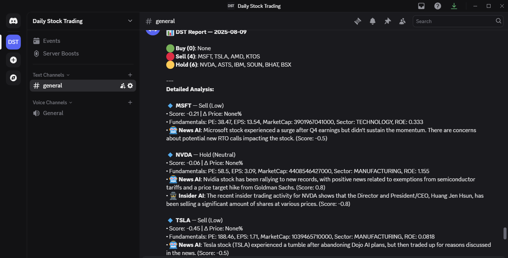
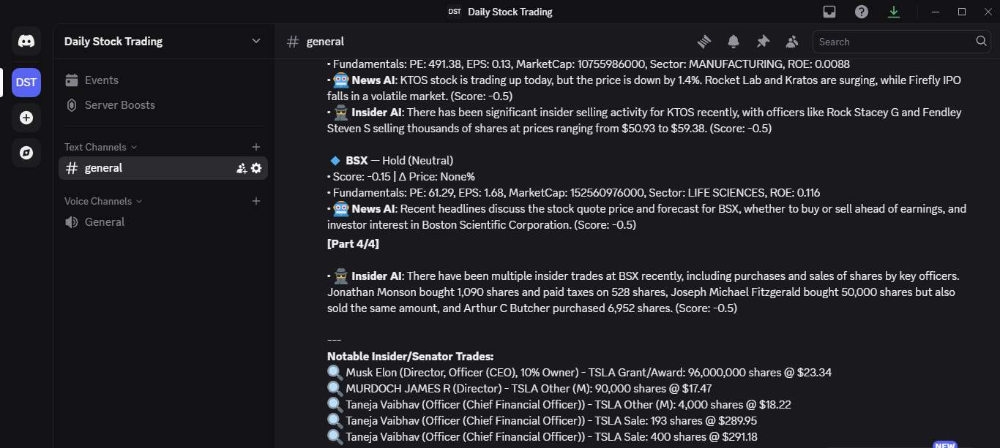

# 📈 DST Trading Agent

An intelligent stock trading analysis system with Discord integration, insider trading monitoring, and automated daily reports.

## 🏗️ Project Structure

```
dst-agent/
├── 📁 src/                     # Core application code
│   ├── main.py                 # Main orchestrator
│   ├── dst_agent.py           # Trading analysis engine
│   ├── discord_bot.py         # Discord bot for real-time queries
│   ├── scheduler.py           # Daily automation scheduler
│   ├── insider_scraper.py     # SEC insider trading data
│   ├── news_scraper.py        # Stock news aggregation
│   └── send_report.py         # Discord webhook reporting
├── 📁 config/                  # Configuration files
│   └── config.py              # API keys and settings
├── 📁 data/                    # Data storage
│   └── stocks.json            # Stock ticker list
├── 📁 logs/                    # Application logs
├── 📁 scripts/                 # Automation scripts
│   ├── start_discord_bot.bat  # Start Discord bot
│   ├── start_persistent_scheduler.bat  # 24/7 scheduler
│   ├── deploy_cloud.bat       # Cloud deployment
│   └── *.bat, *.ps1, *.sh     # Various utility scripts
├── 📁 deployment/              # Docker & cloud deployment
│   ├── Dockerfile             # Container definition
│   ├── docker-compose.yml     # Multi-service orchestration
│   └── .env.example           # Environment template
├── 📁 docs/                    # Documentation
│   ├── CLOUD_SETUP.md         # Cloud deployment guide
│   └── DISCORD_BOT_SETUP.md   # Discord bot setup
├── 📁 testing/                 # Test files and debugging
└── requirements.txt           # Python dependencies
```

## 🚀 Quick Start

### 1. Setup Environment

```bash
# Clone and enter directory
cd dst-agent

# Install dependencies
pip install -r requirements.txt

# Configure API keys (recommended: environment variables)
# Create a .env file (not committed) or set repo/runner secrets:
copy deployment\.env.example .env
# Then fill in values in .env (or set GitHub Secrets)
```

### 2. Run Components

#### Daily Trading Analysis:

```bash
python src\main.py
```

#### Discord Bot (Real-time):

```bash
python src\discord_bot.py
```

#### Automated Scheduler:

Scheduling is managed by GitHub Actions (see `.github/workflows/daily-report.yml`).
To run once locally:

```bash
python src\main.py
```

### 3. One-Click Scripts

- **Discord Bot**: `scripts\start_discord_bot.bat`
- **24/7 Scheduler**: `scripts\start_persistent_scheduler.bat`
- **Cloud Deploy**: `scripts\deploy_cloud.bat`

## 🏗️ Architecture

### Core Components:

- **Trading Agent** (`src/dst_agent.py`): GPT-assisted analysis engine
- **Discord Bot** (`src/discord_bot.py`): Real-time ticker queries
- **Scheduler (CI)** (`.github/workflows/daily-report.yml`): GitHub Actions cron runs daily
- **Insider Monitor** (`src/insider_scraper.py`): SEC filing analysis
- **News Aggregator** (`src/news_scraper.py`): Market sentiment tracking

### Data Sources:

- **Yahoo Finance**: Stock prices and fundamentals
- **SEC API**: Insider trading transactions
- **Google News**: Market news and sentiment
- **OpenAI GPT**: Analysis and recommendations

## 🔧 Configuration

Environment variables used (via `config/config.py`):

```python
# Required API Keys
OPENAI_API_KEY = "your_openai_key"
DISCORD_WEBHOOK_URL = "your_webhook_url"
DISCORD_BOT_TOKEN = "your_bot_token"
SEC_API_KEY = "your_sec_api_key"
ALPHA_VANTAGE_KEY = "your_alpha_vantage_key"
```

## 📱 Discord Features

### Bot Commands:

- Type any ticker symbol (e.g., "AAPL", "TSLA") for instant analysis
- Automatic detection and response with buy/hold/sell recommendations
- Rich embeds with price data, insider activity, and news sentiment


### Daily Reports:

- Automated analysis of your watchlist
- Top buy/sell recommendations
- Market insights and reasoning
- Delivered via Discord webhook by a daily GitHub Actions run (UTC cron)





## ☁️ Cloud Deployment (Optional)

### Docker (Recommended):

```bash
cd deployment
docker-compose up -d
```

### VPS Setup (Future Option):

1. Choose provider (DigitalOcean, Linode, etc.)
2. Install Docker and Docker Compose
3. Clone repository and configure `.env`
4. Run deployment script

See `docs/CLOUD_SETUP.md` for detailed instructions (if self-hosting).

## 🛠️ Development

### Adding New Features:

1. Core logic goes in `src/`
2. Scripts for automation in `scripts/`
3. Documentation in `docs/`
4. Tests in `testing/`

### File Organization:

- **Source Code**: All Python modules in `src/`
- **Configuration**: API keys and settings in `config/`
- **Automation**: Batch files and scripts in `scripts/`
- **Deployment**: Docker files in `deployment/`
- **Documentation**: Guides and setup in `docs/`

## 📊 Features

- ✅ **Real-time Analysis**: Discord bot for instant ticker lookup
- ✅ **Insider Trading**: SEC filing monitoring and alerts
- ✅ **News Sentiment**: Automated news analysis and scoring
- ✅ **Daily Reports**: Scheduled analysis and Discord delivery
- ✅ **Cloud Ready**: Docker containerization for easy deployment
- ✅ **Multi-Platform**: Windows batch files and Linux shell scripts

## 🔐 Security

- Environment variables for API keys
- Docker secrets support
- No hardcoded credentials
- Secure webhook endpoints

## 📈 Trading Logic

The agent analyzes stocks using:

1. **Technical Indicators**: Price trends and momentum
2. **Insider Activity**: Executive buying/selling patterns
3. **News Sentiment**: Market perception and events
4. **GPT Analysis**: Comprehensive reasoning and recommendations

## 🎯 Future Work

- Web dashboard for portfolio tracking
- Advanced technical indicators and factor models
- Options flow monitoring
- Risk management and position sizing
- Robust backtesting harness
- Cloud/self-hosted scheduler (replace CI-based scheduling if needed)

## 🤝 Contributing

1. Fork the repository
2. Create feature branch
3. Add tests in `testing/`
4. Update documentation in `docs/`
5. Submit pull request

---

**Disclaimer**: Educational purposes only. Not financial advice.
